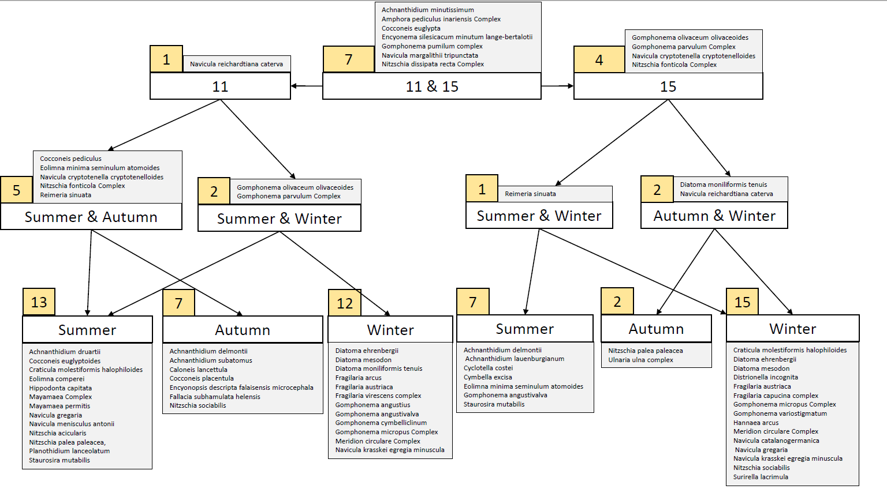
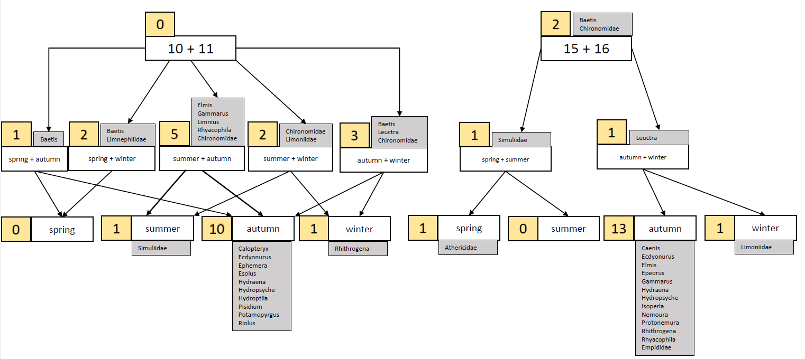

```{r setup, include=FALSE}
# set to TRUE if you want to speed up computation 
knitr::opts_chunk$set(cache = TRUE,fig.pos = 'H',fig_cap=TRUE)

pacman::p_load(
        cowplot,
        data.table,
        dplyr,
        ggplot2,
        here,
        kableExtra,
        knitr,
        viridis
        )
```

\clearpage

\renewcommand{\baselinestretch}{0.5}\normalsize
\tableofcontents
\renewcommand{\baselinestretch}{1.1}\normalsize

# TODO
```{r}
# TODO discuss PCoA plots shortly
# TODO change labels in PCoA
# TODO add taxa lists 
# TODO based on what criteria where the seasonal communities selected. 
```

\clearpage
# Introduction 
In GetReal, we investigate whether different receiving systems typically harbor assemblages that are distinct enough in their sensitivity toward various anthropogenic chemical stressors to merit special consideration in the risk assessment processes. After we agreed on using the pan-european river typology proposed by @LycheSolheim2019 to delineate the receiving freshwater systems, the next step was to derive typical assemblages for them. Here we describe the methods we used to derive typical assemblages of macro-invertebrates and diatoms for selected river types across Europe. We also describe and briefly discuss the results.

# Harmonizing taxa names
International diatom occurrence data sets require extensive harmonization because of the taxonomic resolution differing between data sets, different working groups using different nomenclatures, identification errors, and ongoing changes to the accepted nomenclature [@Kahlert2020]. Harmonization can reduce overall taxonomic resolution but also improve the detection of large-scale spatio-temporal patterns [@Lee2019]. We compared all our data sets against a series of databases that contain accepted names, synonyms with links to the respective accepted names and suggestions for grouping contentious taxa in larger complexes. If a taxon name was found in one of the databases the name was accepted, changed into the accepted name in case it was a synonym, or grouped into the respective complex. Once a taxon was found in a database, it would not be included in queries of subsequent databases. However, if the accepted name differed from the original one, the accepted name would be queried through all previous databases again. The results were also controlled visually for consistency. The following databases were used in the same order: 

1.	Table S2 from @Kahlert2020
2.	The taxon list associated with the OMNIDA software [@lecointe1993omnidia]
3.	The German list of freshwater organisms [@Mauch2017]
4.	The diat.barcode database [@Rimet2019]
5.	The website algaebase.org [@guiry2020]
6.	The global biodiversity information platform (gbif) [@gbif2020]


The harmonization of macro-invertebrate data required less effort, and was achieved with gbif [@gbif2020] through the taxize R package [@Chamberlain13]. 

# What is the optimal taxonmic level? 
One result of the last progress review for GetReal (held on the 29.04.2020) was that taxa in the typical assemblages (TA) should be included on their respective optimal taxonomic level 
instead of using one level (e.g. Genus) for all. *Oligochaetes*, for example, are usually only determined to subclass level, which should not prevent them to be part of a TA if
they are common in a given river type. Thus, the question arises: given a data set, what is the optimal taxonomic level to represent a specific taxon?  
The following refers exclusively to the marco-invertebrate data, as the taxnomic resoltuion is generally no an issue with diatom data sets. We shortly describe the procedure for diatom data at the end of the section. To establish the optimal level, we used a hierarchical approach. First, we removed all observations from Phyla and Classes that were not present 
in all data sets. We assumed that these represented differences in sampling rather than in communities. That left us with the classes Clitellata (Annelida), Insecta, Malacostraca (Arthropoda), Bivalvia and Gastropoda (Mollusca).  
In the following, a higher taxonomic level refers to levels with higher resolution, i.e. species is the highest taxonomic level and kingdom the lowest. For each taxon, we calculated the percentage of observations that are represented at each higher level. For example, 4.12% of observations from the order *Lepidoptera* are at the species level, 74.77% at the genus level, 7.75% at the family level, and 13,35% at the order level. Now given a threshold X, which is to be determined, we would call a taxon optimally represented at a certain taxonomic level if less than X% are represented by higher levels. For example, *Lepidoptera* would be represented on order level if X > 4,12% + 74,77% + 7,75% = 86,64%. As there are no theoretical grounds on which to base such a threshold value we searched for noticeable patterns in the data (Figure  \@ref(fig:mzb-thresh-plot)). The most salient change occurs between 85% and 86%. It occurs because for X > 86% *Chironomidae* are represented at the family level. Hence, we used 85% as threshold. Observations that were missed by this procedure, e.g. observations of *Chironomidae* at the family level, were included at their respective level.   

```{r mzb-thresh-plot, echo=FALSE, fig.align="center", fig.height=3, fig.cap="Number of macro-invertebrate observations at a given taxonomic level as function of the threshold value"}
plot_data <- readRDS("../../../002_working_package_02/001_community_data/002_combined/002_invertebrates/003_processed_data/001_2020-10-01_threshold_plot_data")
plot_data %>% 
        ggplot(aes(x = thresholds, y = number, col = taxon_level)) + 
        geom_point() + 
        geom_line() + 
        ylab("number of observations") + 
        xlab("theshold") + 
        labs(col = "taxon level") + 
        theme_minimal()
 rm(plot_data)
```

For the diatoms, we employed 75\% as threshold, because for *Gomphonema*, which is the fourth most common genus in our data set, 81.43\% of the observations were at the species level. The taxonomic resolution was higher than in the macroinvertebrate data and the lowest resolution is the genus level. The equivalent of figure \@ref(fig:mzb-thresh-plot) for diatoms can be found [here](https://github.com/JonJup/GetReal/tree/master/002_working_package_02/001_community_data/002_combined/001_diatoms/004_plots/threshold_plot)

# Can we represent the stream types with our data? 

We determined visually whether a our data set contained enough sampling sites in a given river type to derive meaningful TAs. The degree of representation for river type was graded in a three-tier system: high, medium, and low. A high degree of representation indicates, that we have many sampling locations, which are distributed across the instances of a river type which fall within the countries considered in GetReal. A low degree indicates the opposite, i.e. few and spatially clustered sites. A medium rating implies that we either have many sampling sites, but these only extend over parts of the countries or few sites that extend over most of the countries. The ratings for all river types for macro-invertebrates and diatoms are shown in table \@ref(tab:tbl-rating).  

```{r tbl-rating, echo=FALSE}
data <- data.frame("Rating"=rep(c("high", "medium", "low"), each=2),
                   "Taxon"=rep(c("macro-invertebrates","diatoms"), times = 3),
                   "River Types"=c(c("4, 5, 9, 10, 11, 12, 13, 16"), 
                                   c(""), 
                                   c("1, 2, 3, 8, 14, 15, 18"), 
                                   c("1, 2, 3, 4, 5, 6, 8, 9, 12, 14, 16, 17, 18, 19"), 
                                   c("6, 7, 17, 19, 20" ),
                                   c("7, 10, 11, 13, 15, 20")
                                   )
)
data %>% 
        kable(caption = "The ratings for all river types for macro-invertebrates and diatoms") 
rm(data)
```

For each river type we provide maps with the associated sampling sites for [macro-invertebrates](https://github.com/JonJup/GetReal/tree/master/002_working_package_02/001_community_data/002_combined/002_invertebrates/004_plots/001_sampling_site_maps) and for [diatoms](https://github.com/JonJup/GetReal/tree/master/002_working_package_02/001_community_data/002_combined/001_diatoms/004_plots/sampling_maps).  
Further analyses were conducted for all stream types with a high or medium degree of representation. More information on the river types is available in @LycheSolheim2019. In general, we have fewer sampling sites for diatoms than for macro-invertebrates which entails that the representation of stream types is generally lower. 

# What is a typical Assemblage? 
We derived TAs based on a rule that considered:    

1. The probability of site $x$ belonging to stream type $z$ given that species $y$ is present (a measure of specificity, henceforth **A**)  
2. The probability of species $y$ being present given that site $x$ belongs to stream type $z$ (a measure of commonness, henceforth **B**)  
3. The Species Indicator Value   

The Species Indicator Value [@Caceres2009; @Dufrene1997]  is the weighted product of **A** and **B** (see Equation \@ref(eq:label)) 
\begin{equation}
\sqrt{Indval} = \sqrt{A_g\times B} = \sqrt{\frac{\frac{n_p}{N_p}}{\Sigma_{k=1}^K\frac{n_k}{N_k}}\times\frac{n_p}{N_p}} (\#eq:label)
\end{equation}

where $N_p$ is the number of sites that belong to river type $p$ and $n_p$ the number of occurrences of the focal species in sites of type $p$. $K$ is the number of river types. **A** is weighted by the total number of occurrences to account for unequal sample sizes. The statistical significance of the Indicator Value can be assessed with permutation-based pseudo-*p*-values, which we did with 999 permutations.
Here, we are not interested in indicator species for each community, but TAs. Hence, simply continuing with those species that have a pseudo-*p*-value below some significance level would not serve our purpose. A species that occurs at each site, across all stream types, highlights the difference: while it would not be indicative of any stream type (low specificity) it should be part of each TA. Hence, we need additional criteria to derive the TAs which can be based on **A**, **B**, and the pseudo-*p*-value of the indicator value. We used the following rules:  
For macro-invertebrates:  
Species were considered typical if  **B** > 0.25 or **B** > 0.20 and *p* < 0.05 or **A** > 0.80  
Genera were considered typical if   **B** > 0.50 or **B** > 0.33 and *p* < 0.05 or **A** > 0.95   
Families were considered typical if **B** > 0.95 or **B** > 0.80 and *p* < 0.01 or **A** > 0.99  

For diatoms:   
Species where considered typical if **B** > 0.4 or **B** > 0.3 and *p* < 0.05 or **A** > 0.7.   
Genera where considered typical if  **B** > 0.8 or **B** > 0.6 and *p* < 0.05 or **A** > 0.95.  

Note that we did not systematically optimize these thresholds. Such procedures would require optimization criteria, but we are not aware of a criterion that would work in this context. We acknowledge that TA could be (i) very similar in composition or (ii) harbor strongly differing numbers of taxa. Thus, parametrizing the rules in a way that would (i) maximize dissimilarity between assemblages or (ii) maximize the mean assemblage richness would not lead to what we consider a typical assemblage. It would be possible to try a cross-validation-type approach where each taxon is scored based on the number of random-site-subsets it is included in, but such an approach would also entail making essentially arbitrary numerical assumptions. We think the use of subjectively defined thresholds is justified, as long as they are clearly and openly communicated, to be what we define as “typical assemblages”. 

However, we conducted a sensitivity analysis to see how much varying the parameters of the rules would alter the results. We altered the threshold values of **A** and **B**. The rules above contain two distinct **B** Threshold: $B_1$ which does not consider the pseudo-*p*-value (**B** > 0.25 for macro-invertebrate species and **B** > 0.40 for diatom species) and $B_2$ which does take the pseudo-*p*-value into account (*p* < 0.05 and **B** > 0.2 macro-invertebrate species and **B** > 0.30 for diatom species ). In the following simulations, the $B_2$ was always taken to be 25% below $B_1$. Henceforth, when referring to the threshold for *B*, we refer to $B_1$. For species, we varied the threshold for *B* in ten steps between 0.10 and 0.75 and that for **A** in ten steps between 0.5 and 1.0. For lower taxonomic levels these thresholds were raised. For genera, the threshold values of **A** and **B** were raised by a factor of 1.25 and 2 respectively. All levels family and and lower taxonomic levels were grouped in “families or lower” (fol). For fol, the thresholds were raised by factors of 1.5 and 3 respectively. The taxon richness and uniqueness scores (see Figure \@ref(fig:plot-uni) and preceding text) of each TA were computed for all 100 combinations of these parameters and each taxonomic level. 
Please note that results are only shown and discussed for the non-redundant TAs (see section \@ref(sec:redundancy)). Taxa richness decreased with increasing **A** and **B** threshold in macro-invertebrates and diatoms (Figure \@ref(fig:plot-sa-mzb)A and Figure \@ref(fig:plot-sa-dia)A), while the uniqueness scores increased with **B** thresholds but decreased with **A** thresholds ((Figure \@ref(fig:plot-sa-mzb)B and Figure \@ref(fig:plot-sa-dia)B)). Uniqueness scores decreased noticeably with very high **A** thresholds (> 0.9), indicating that taxa that are specific to certain river types are an important driver of TA differentiation. Note that macro-invertebrate graphs are only shown for all taxa levels combined while the diatom plot only shows species. Plots for each taxon level separately are available for [macro-invertebrates](https://github.com/JonJup/GetReal/tree/master/002_working_package_02/001_community_data/002_combined/002_invertebrates/004_plots/002_zwischenbericht). However, the general patterns visible in Figure \@ref(fig:plot-sa-mzb) and Figure \@ref(fig:plot-sa-dia), hold for them as well. 

```{r plot-sa-mzb, echo=FALSE, fig.align="center",fig.height=10, fig.width=10,fig.cap="Changes in taxon richness along a changing B threshold. Line color indicates the A threshold"}
n_types = 9
plot_data <- readRDS("../../../002_working_package_02/001_community_data/002_combined/002_invertebrates/003_processed_data/00x_for_plot_mzb_sa.RDS")
p1 <- plot_data %>%
        ggplot(aes(x = B_threshold, y = n_taxa, col = A_threshold)) + 
        geom_line(size = 1.5, alpha = 0.8, aes(group = A_col)) +
        ggtitle("Macro-invertebrates - Richness - All Levels") + 
        facet_wrap(. ~ river_type) + 
        scale_color_viridis() + 
        ylab("species richness") + 
        xlab("B Threshold") + 
        labs(col = "A Threshold")
rm_id <- which(is.na(plot_data$us_gen))
plot_data <- plot_data[-rm_id,]
p2 <- plot_data %>% 
        ggplot(aes(x = B_threshold, y = us_taxa, col = A_threshold)) + 
        geom_hline(yintercept = 1/n_types, linetype = 2) + 
        geom_line(size = 1.5, alpha = 0.8, aes(group = A_col)) + 
        ggtitle("Macro-invertebrates - Uniqueness - All levels") + 
        facet_wrap(.~river_type) + scale_color_viridis() + ylab("uniqueness score") + 
        xlab("B Threshold") + 
        labs(col = "A Threshold")
plot_grid(align='v', p1, p2, labels = c('A', 'B'), ncol = 1)
rm(n_types, rm_id, plot_data, p1, p2)
```

```{r plot-sa-dia, echo=FALSE, fig.align="center",fig.height=10, fig.width=10,fig.cap="Changes in uniqueness score along a changing B threshold. Line color indicates the A threshold"}
n_types = 13
plot_data <- readRDS("../../../002_working_package_02/001_community_data/002_combined/001_diatoms/003_processed_data/00x_plotdata_sensitivity_analysis.RDS")
plot_data[,n_taxa := n_genera + n_species]
p1 <- plot_data %>%
        ggplot(aes(x = B_threshold, y = n_taxa, col = A_threshold)) + 
        geom_line(size = 1, alpha = 0.8, aes(group = A_col)) +
        ggtitle("Diatoms - Richness - Species") + 
        facet_wrap(. ~ river_type) + 
        scale_color_viridis() + 
        ylab("species richness") + 
        xlab("B Threshold") + 
        labs(col = "A Threshold")
p2 <- plot_data %>% 
        ggplot(aes(x = B_threshold, y = us_spe, col = A_threshold)) + 
        geom_hline(yintercept = 1/n_types, linetype = 2) + 
        geom_line(size = 1, alpha = 0.8, aes(group = A_col)) + 
        ggtitle("Diatoms - Uniqueness - Species") + 
        facet_wrap(.~river_type) + scale_color_viridis() + ylab("uniqueness score") + 
        xlab("B Threshold") + 
        labs(col = "A Threshold")
plot_grid(align='v', p1, p2, labels = c('A', 'B'), ncol = 1)
rm(n_types, plot_data, p1, p2)

```


# Redundancy between typical assemblages {#sec:redundancy}

We assessed thr degree to which the different TAs overlap (Table \@ref(tab:tbl-redundancy)). The degree of overlap is the percentage of taxa in a TA that is also present in the most similar (largest overlap) TA. Again, choosing a threshold above which we consider two assemblages to be redundant is somewhat arbitrary. We proceeded with 75\% but are open to other suggestions. This threshold leads to five redundant assemblages in macroinvertebrates and none in diatoms. Of the redundant TAs most belong to two river types that only differ in river size: RT02 and 03, 04 and 05, 08 and 09, as well as 10 and 11. The only exception is the combination of RT15 and 16. Both are high altitude river types that occur mainly in southern Europe, which differentiates them from the northern high altitude rivers in RT14. RT13 is also redundant with RT02 and 03 however joining it with these two river types led to a drastically reduced number of taxa in the TA, when compared to that of the combined river type RT02+03. Since RT13 represents an exceedingly rare river type we decided to omit it from the analysis and proceed with RT02+03 instead of RT02+03+13. The new TAs resulted in overall lower degrees of overlap, none of which exceeds the 75% threshold. The largest overlaps were between RT8+9 and RT10+11, with 70%. 
     

```{r tbl-redundancy, echo=FALSE}
data <- data.frame("River Type"=paste0("RT", 
                                        c(1:6, 8:19)
                                       ),
                   "Macroinvertebrate"=c(
                           "RT2+4 (25%)",    #RT1
                           "RT3 (88.2%)",    #RT2
                           "RT2 (68.2%)",        #RT3
                           "RT3 (45.8%)",    #RT4
                           "RT4 (83.3%)",    #RT5
                           "",               #RT6
                           "RT10 (77.8%)",    #RT8
                           "RT8 (76.5%)", #RT9
                           "RT11+18 (65.2%)", #RT10
                           "RT10 (88.2%)", #RT11
                           "RT9 (50.0%)",    #RT12
                           "RT2 (87.5%)",    #RT13
                           "RT16+18 (69.2%)",    #RT14
                           "RT16 (85.7%)",    #RT15
                           "RT9+10+11+15 (57.1%)",    #RT16
                           "",      #RT17
                           "RT10 (55.6%)",    #RT18
                           ""     #RT19    
                   ),
                   "Diatoms"=c(
                           "RT2 (62.9%)",    #RT1
                           "RT1 (46.8%)",    #RT2
                           "RT2 (48.7%)",    #RT3
                           "RT2 (74.1%)",    #RT4
                           "RT2 (62.5%)",    #RT5
                           "RT12 (38.3%)",    #RT6
                           "RT2 (71.4%)",    #RT8
                           "RT5+8 (56%)", #RT9
                           "", #RT10
                           "", #RT11
                           "RT6 (40.9%)",    #RT12
                           "",    #RT13
                           "",    #RT14
                           "",    #RT15
                           "RT18 (56.5%)",    #RT16
                           "RT1 (63%)",      #RT17
                           "RT1 (71.4%)",    #RT18
                           "RT17 (68.4%)"    #RT19
                           )

)
data %>%
  kable(caption = "Overlap between different typical assemblages.") %>%
  kable_styling(latex_options = "hold_position")


rm(data)
```

# Characteristics of typical assemblages

In all macro-invertebrate TAs, genus is the prevalent taxonomic level (figure \@ref(fig:plot-mzb-n-taxa)A). The numbers of species and fol are similar with both exceeding the other in four assemblages. The mean number of species was 3.2, mean number of genera 14.3, and the mean number of fol 2.4. RT01 and RT14 where the smallest assemblages with 13 taxa both and RT18 was the most taxa rich assemblage with 28 taxa. For diatoms, species is the prevalent taxonomic level in all TAs ( figue \@ref(fig:plot-mzb-n-taxa)B). Some assemblages consist entirely of species (i.e. RT04, 06, 09, 16, 17, and 19). The mean number of species per TA is 30 and the mean number of genera 0.5. RT03 has the most taxa rich TA with 49 taxa and RT19 has the least taxa in its TA with 18.  

```{r plot-mzb-n-taxa, echo=F, fig.height=5,fig.width=10, fig.cap="Numbers of taxa on each taxonomical level for all typical assemblages"}
source("../r/plot_mzb_n_taxa.R")
source("~/01_Uni/02_getreal/005_documents/2020_10_Zwischenbericht an RLT/r/plot_dia_n_taxa.R")
plot_grid(align='h', mzb_per_level_plot, dia_per_level_plot, labels = c('A', 'B'), ncol = 2)
```


We can express the uniqueness of a TA with the following score: Each taxon receives a taxon uniqueness score that is one divided by the number of TAs it occurs in. For each river type, we sum the taxon scores of all taxa up and divide it by the number of taxa in the river type’s TA. If all taxa in the TA are unique to that TA the score is one. If all species occur in one other TA the score is 0.5. The minimal score depends on the number of TAs, as it is 1 divided by that number and it signals that all species in that TA occur in all other TAs. These scores are shown in figure \@ref(fig:plot-uni). The dashed horizontal lines indicate respective the minimum scores.  

```{r plot-uni, echo=FALSE, fig.align="center", fig.cap="Uniqueness scores for typical assemblages of macro-invertebrates(A) and diatoms (B). The red dashed line indicates the lowest possible score.", fig.width=6,fig.height=4}
source(file = "../r/plot_unique.R")
plot_grid(align='h', plot_uni_mzb, plot_uni_dia, labels = c('A', 'B'), ncol = 2)
```

We also used Principal Coordinate Analysis (PCoA, @gower1966some) to visualize the similarity of TAs, based on Jaccard distance matrices (Figure \@ref(fig:pcoa)). 

```{r pcoa, echo=FALSE, fig.height=6, fig.cap="Principal Coordinate Analysis ordinations of typical assemblages based on Jaccard distance matrices. A shows the typical asseblages of macro-invertebrates and B those of diatoms."}
source("../r/pcoa.R")
plot_grid(align='v', bim, bid, labels = c('A', 'B'), ncol = 1)
```

<!-- Discuss PCoA Plots --> 
  <!-- MZB -->
The first axis in the macro-invertebrate PCoA represents an altitude gradient going from lowland (RT1, RT2+3, RT4+5), over mid-altitude (RT8+9, RT10+11, RT12, RT18), to high altitude (RT14, RT15+16). Mid altitude stream are between 200-800 meters above sea level and the other two groups are lower or higher respectively.  
RT08+09 and RT10+11 are the most similar which agrees with the considerable overlap (70%) we found before. Both river types represent mid-altitude of all sizes. The difference is that RT08+09 are siliceous river and RT10+11 are calcareous. The difference in geology seems not to lead to strongly diverging TAs.  None of the taxa that the two TAs differ in is considered indicative of geology, however several are typical for mid- to high-altitude stream (e.g. *Amphinemura* and *Protonemura*). The difference between siliceous (RT14) and calcareous(15+16) becomes more pronounced with increasing altitude. Also, the TAs mid-altitude streams from the Mediterranean (RT18) is more distinct from other RT8+9 and RT10+11 but similar to that of RT12 which are mid-altitude streams with many (>20% Catchment area) histosol soils in their catchment. The lowland TAs are distinct from the mid- and high-altitude TAs and from each other. This agrees with the high uniqueness scores of RT1 and RT2+3. The similartiy between RT12 and RT15+16 is quite surprising given the large geographic distance between sampling sites (see [sampling maps](https://github.com/JonJup/GetReal/tree/master/002_working_package_02/001_community_data/002_combined/002_invertebrates/004_plots/001_sampling_site_maps)).   
  <!-- Diatoms -->
In the PCoA of diatom TAs, the river types RT16 to 19 form one group. RT17 to 19 are Mediterranean streams and RT16 are glacial streams that also fall mainly within the region (the Pyrenees, the Western Alps, and the Central Alps. We do not have sampling sites in the later). RT17 (Mediterranean, lowland, medium-Large, perennial) is further removed from the core of the cluster. Potentially because they are the only lowland stream type in that group.  The second cluster consists of river types RT01 to 5 as well as RT08 and 9. The river types RT01, 4, 8 are one subcluster as are RT02 and 03. RT 05 connects the first to the second subcluster and RT09 is more similar to the first but noticeably removed from it. The structuring can be read as a size gradient. RT1,4,8 are very similar RT01 are very large rivers and RT04 and 8 are both medium to large, while RT05 and 09 are the respoective smaller versions of RT04 and 08. Interestingly the imprint of the non-size-related characteristics of the rivers are more pronounced in smaller streams (i.e. RT05 and RT09 are more distinct than RT04 and RT08). 
The two TAs RT06 and RT12 are further removed from the formerly described clusters. Both represent rivers that are highly influenced by organic matter, which is known to impact diatom communities \@Hering2006.

The taxalists of the typical assemblages can be found [here](). 

# Seasonal Typical Assemblages 
In addition to the spatially defined TAs, we derived seasonal TAs (sTA) for a subset of river types. The four seasons were defined as follows: spring is March to May, Summer is June to August, Fall is September to November, and Winter is December to February. 

To avoid strong spatial signals in the sTA only those river types (RT) were considered in which samples were evenly distributed between seasons. In most cases, an even spatio-temporal distribution could only be achieved by omitting parts of the data (e.g. certain seasons or data sets). The maps for all RT with all available seasons as well as the respective subsets that were used in the further analyses can be found in the here for macroinvertebrates and here for diatoms.  As an example, the map of macroinvertebrate samples for the combined RT 10+11 is shown in Figure \@ref(fig:sampling-map2).

```{r sampling-map1, echo=FALSE}
source(file = "../r/sampling_map.R")
```
```{r sampling-map2, echo=FALSE, fig.cap="Map of sampling sites for the combines River Type 10 + 11. The color of the points shows the season of sampling."}
plot_object
```
```{r clean-sampling-map, echo=FALSE, results="hide"}
rm(plot_object, data, mcp_sub, osm, plot_data);gc()
```

To visualize differences between the seasons we used Non-metric multidimensional scaling (NMDS) on Jaccard dissimilarity matrices. The resulting NMDS plots are available in the for [macroinvertebrates](https://github.com/JonJup/GetReal/tree/master/002_working_package_02/003_seasonality/004_plots/invertebrates) and [diatoms](https://github.com/JonJup/GetReal/tree/master/002_working_package_02/003_seasonality/004_plots/diatoms/nmds). Figure \@ref(fig:plot-nmds) shows the NMDS plot for invertebrate samples in RT10+11. 

```{r load-nmds, echo=FALSE}
source("../r/plot_nmds.R")
```
```{r plot-nmds, echo=FALSE, fig.cap="Nonmetric multidimensional scaling plot of Jaccard dissimilarity matrices for macroinvertebrate communities in RT10 + 11. The color of the points shows the season. Convex hulls surround all sampling points from one season."}
nmds_plot
```
```{r clean-plot-nmds, echo=FALSE, results="hide"}
rm(list =ls());gc()
```

Further, we evaluated whether the Jaccard dissimilarity between sites would be better explained by spatial distance or by season. To this end, we employed generalized dissimilarity modeling (GDM, @Ferrier2007). In GDMs, the response variable is the ecological dissimilarity between two sites (expressed in some *a priori* chosen dissimilarity metric, here Jaccard). Smooth functions are fitted to the environmental data and the differences between the values of these functions at the two sites of interest are used as explanatory variables. By using a generalized modeling framework we can account for the bounded nature of dissimilarity metrics (between 0-1) and the smooth functions allow for variation in the rate of compositional turnover along gradients. The plots comparing the effect of spatial distance to that of season for all GDMs are available for [macroinvertebrates](https://github.com/JonJup/GetReal/tree/master/002_working_package_02/003_seasonality/004_plots/invertebrates/gdm) and [diatoms](https://github.com/JonJup/GetReal/tree/master/002_working_package_02/003_seasonality/004_plots/diatoms/gdm). The plot for invertebrates in RT10 + 11 is shown in Figure \@ref(fig:plot-gdm). 

```{r load-gdm, echo=FALSE}
source("~/01_Uni/02_getreal/005_documents/2020_10_Zwischenbericht an RLT/r/plot_gdm.R")
```
```{r plot-gdm, echo=FALSE, fig.cap="Partial ecological distance between sites with increasing geographic distance (A) or chaning season (B, 1 = spring, 2 = summer, 3 = summer, and 4 = winter) predicted with Generalized Dissimilarity Models"}
gdm_plot
```
```{r clean-plot-gdm, echo=FALSE, results="hide"}
rm(list =ls());gc()
```

Based on the results of NMDS and GDMs, we selected RT 10 + 11 and RT 15 + 16 for invertebrates and RT10 and RT15 for diatoms. For these four river types sTA were derived in the same way as the non-seasonal TAs.  

# Patterns and overlap in seasonal assemblages 
In river type 11, the number of diatom taxa in the sTAs did not vary strongly between the seasons (Table \@ref(tab:tbl-sta-overlap-dia-11)). The summer and autumn sTAs were more similar to each other than either of them was to the winter sTA. The latter was most similar to the summer sTA, as they share some Gomphonema species (*Gomphonema olivaceum olivaceoides* and *Gomphonema parvulum* Complex) which are absent from the autumn sTA with exception of *Gomphonema pumilum* Complex. 

```{r load tbl-sta-overlap-dia, echo=FALSE}
om11 <-readRDS("../r/tbl_sta_dia_11.RDS")
om15 <-readRDS("../r/tbl_sta_dia_15.RDS")
```

```{r tbl-sta-overlap-dia-11, echo=FALSE}
om11 %>% 
  kable(caption="Overlap between seasonal typical assemblages (sTA) of diatoms in river type 11  expressed in percent of taxa in row sTA also present in column sTA. N is the number of taxa in the respective sTA.")
```

```{r tbl-sta-overlap-dia-15, echo=FALSE}
om15 %>% 
  kable(caption="Overlap between seasonal typical assemblages (sTA) of diatoms in river type 15  expressed in percent of taxa in row sTA also present in column sTA. N is the number of taxa in the respective sTA.")
```

For diatom in RT 15, the winter sTA is considerably larger than the summer and autumn sTAs (Table \@ref{tab:tbl-sta-overlap-dia-15}.  
Both, the summer and the autumn sTAs, overlap 81.2% with the winter sTA.  Therefore, they cross the threshold of 75% overlap we used to delineate redundant TAs. The overlap between the winter sTA and either summer or autumn sTA is of a similar size (41.4% and 44.8%). In general, the overlaps in river type 15 are larger than those in river type 11 which might indicate a weaker seasonal turnover in these ecosystems. 

For the macroinvertebrates, the number of taxa in the sTAs is lower than for diatoms. In both river types, the number of taxa in the autumn sTA is also markedly higher than for all other macroinvertebrate sTAs. 
In the combined river type 10 + 11, the spring sTA was nested in the winter sTA and had no overlap with the summer sTA (Table \@ref(tbl:tbl-sta-overlap-mzb-11)). The summer sTA was most similar to the autumn TA (71.4% overlap) and vice versa (29.4% overlap). Half of the taxa in the winter TA are also part of the autumn TA which is the highest overlap for the winter TA. 
```{r load tbl-sta-overlap-mzb, echo=FALSE}
om11 <-readRDS("../r/tbl_sta_mzb_11.RDS")
om15 <-readRDS("../r/tbl_sta_mzb_15.RDS")
```

```{r tbl-sta-overlap-mzb-11, echo=FALSE}
om11 %>% 
  kable(caption="Overlap between seasonal typical assemblages (sTA) of macroinvertebrates in the combined river type 10+11  expressed in percent of taxa in row sTA also present in column sTA. N is the number of taxa in the respective sTA.")
```

```{r tbl-sta-overlap-mzb-15, echo=FALSE}
om15 %>% 
  kable(caption="Overlap between seasonal typical assemblages (sTA) of diatoms in river type 15  expressed in percent of taxa in row sTA also present in column sTA. N is the number of taxa in the respective sTA.")
```

In the other combined river type considered here, RT 15 + 16, the summer sTA is nested within the spring sTA and the winter sTA is almost nested within the autumn sTA (Table \@ref(tbl:tbl-sta-overlap-mzb-15). *Limnoidae* is the only taxon that occurs in the winter sTA but not the autumn sTA. Across this divide, the sTAs only share the two taxa which are common to all four: *Baetis* and *Chironomidae*.

Several possible mechanisms that could explain the higher richness in diatom sTAs compared to macroinvertebrate sTAs as well as the higher richness in autumn sTAs observed for invertebrates are explored below. There might be a connection between the number of samples taken and the size of the TAs. The effect could plausibly be hypothesized to increase or decrease the size of the TA with an increasing number of sampling locations. A decrease in TA size could occur because the absolute number of occurrences required to be included in the TA is increased with the number of sampling sites.  In this model, the high number of taxa would be caused by taxa that are only included because of noise. The number should decrease if more samples would be taken. An increase in TA size with an increasing number of sampling sites could occur because the total impact of atypical sites which might be overrepresented in the sample by happenstance would most certainly decrease. Here, atypical refers to the community composition, i.e. taxa that are rare in other sites occur and otherwise frequently occurring taxa are absent.  Similar effects might also account for the difference between diatoms and macroinvertebrates. In a linear regression of the size of typical assemblages against the number of sampling locations (log-transformed) across taxa groups, no relationship was identified (F = 0.569, df = 12, p = 0.47, $R^2$ = 0.05,  Figure \@ref(fig:fig-test)).  

```{r fig-test, echo=F, fig.height=3.5,fig.width=7, fig.cap="Regression of the taxon richness of typical assemblages against the number of sampling locations. Gray shaded area shows the 95% confidence interval for the regression line. The color of the dots indicates the taxon group."}
data<-data.frame(n_samples = c(55,188,103,39, 7,42,27,36, 157,52,13, 82,19,52),
           TA        = c(2,7,17,6,4,3,16,4, 28,21,22, 19,16,29),
           taxon     = c("Macroinvertebrate", "Macroinvertebrate", "Macroinvertebrate", "Macroinvertebrate",
                         "Macroinvertebrate", "Macroinvertebrate", "Macroinvertebrate", "Macroinvertebrate", 
                         "Diatom", "Diatom", "Diatom", "Diatom", "Diatom", "Diatom"))
options(warn = -1)

ggplot(data, aes(x = log(n_samples), y = TA)) + 
        geom_smooth(method='lm', formula= y~x) + 
        geom_point(aes(col = taxon)) +
        ylab("taxon richness of typical assemblage") + 
        xlab("log number of samples")
```

The number of sampled communities does not differ strongly between taxa (Table 6). Most importantly, the number of macroinvertebrate samples for one river type is lower than that of diatom samples in RT11 and RT15 while the other one is higher. Thus, the overall difference in richness can not be explained by the number of sampled communities. The mean number of taxa in diatom communities was lower than in macroinvertebrate communities. The total number of taxa was also lower for diatoms than for invertebrates. This might partly also be due to the extensive harmonization efforts that summarized some diatom species in larger complexes. However, it also highlights that there is less variation between sites within river types, which is conductive to larger TA. Strong turnover between sites within one RT or season leads to low average fidelity (B value) and consequently to few taxa that are included in the typical assemblages.   
The methodology we employed is an implicit test of the fit of the river typology to our data. If the communities would vary independently of the typology, TAs would include few or no taxa. 

```{r tbl-summary-stats, echo=F}
data <- data.table("Class" = rep(c("Invertebrates", "Diatoms"), each=2), 
                   "RT" = paste0("RT", c("10+11", "15+16", "11", "15")),
                   "N samples" = c(385, 112, 265, 230),
                   "mean richness" = c(32.7, 22.9, 23.3, 17.1),
                   #"Median richness"= c(32, 23, 22.5, 16),
                   "SD richness" = c(11.7, 9.3, 7.1, 6.5),
                   "N taxa"=c(257, 113, 140, 99),
                   "Samples per Season"=c("55/188/103/39", "7/42/27/36", "0/157/52/13", "0/82/19/52")
)
data %>% 
  kable(caption=
"Summary statistics of samples used to delineate seasonal typical assemblages.Rt is the river type. N samples is the total number of samples taken in the respecitve river type. Mean richness is the mean number of taxa found at a sampling event. Medians are not shown but do not deviate strongly from means. SD richness is the standard deviation of taxa richness and N taxa the total number of taxa found in a river type.In the last column \"Samples per Season\" the seasons go from spring to winter.", 
        format="latex") %>% 
  kable_styling(font_size = 11)
                                       
```

The taxa lists for typical assemblages can be obtained for macroinvertebrates and diatoms. We also visualized the nestedness of communities. 

\blandscape
test
# ```{r img_dia_sta, echo=FALSE}
#  
# ```
\elandscape
\newpage
\blandscape
test
# ```{r img_mzb_sta, echo=FALSE, out.width=5}
#  
# ```
\elandscape
\newpage

# Notes for Traits 
CWM with B value then RR-VGLM (glm RDA)

# References